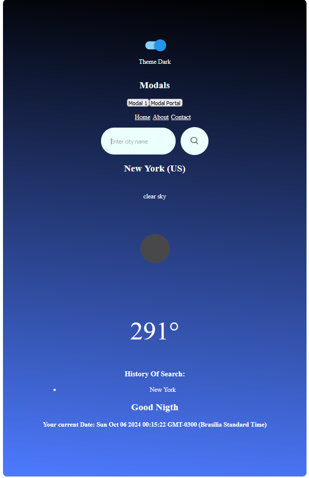

# Climate App 🌦️

A simple weather application that allows users to search for current weather conditions in any city around the world. This app fetches real-time data from the OpenWeatherMap API and displays essential weather information like temperature, humidity, and more.



## Features

- 🌍 **Search by City**: Get real-time weather data for any city.
- 🌡️ **Current Weather Information**: Displays temperature, humidity, and weather description.
- 🧪 **Unit Tests**: Includes testing setup with Vitest and React Testing Library.
- 🎛️ **Theme Toggle**: Uses a switch component to toggle between themes (light/dark mode).

## Technologies Used

- **React**: For building the user interface.
- **Vite**: A fast build tool for modern web projects.
- **React Router DOM**: For client-side routing.
- **React Switch**: For the theme toggle feature.
- **Vitest**: For unit testing.
- **Testing Library**: For testing React components.
- **ESLint**: For linting JavaScript/JSX files.
- **dotenv**: For managing environment variables.

## How It Works

1. The user enters a city name to search.
2. The app makes a request to the [OpenWeatherMap API](https://openweathermap.org/) and retrieves current weather data.
3. Weather details such as temperature, humidity, and description are displayed.

## Getting Started

### Prerequisites

Ensure you have the following installed:

- Node.js
- npm or yarn

### Installation

1. Clone the repository:

   ```bash
   git clone https://github.com/your-username/climate-app.git
   cd climate-app
   ```

2. Install dependencies:

   ```bash
   npm install
   # or
   yarn install
   ```

3. Set up environment variables by creating a `.env` file in the root directory with your OpenWeatherMap API key:

   ```bash
   REACT_APP_WEATHER_API_KEY=your_api_key_here
   ```

4. Start the development server:
   ```bash
   npm run dev
   # or
   yarn dev
   ```

## Running Tests

To run the test suite:

```bash
npm run test
```

For test coverage:

```bash
npm run coverage
```

## Scripts

- `dev`: Start the development server using Vite.
- `build`: Build the project for production.
- `lint`: Run ESLint to lint the code.
- `preview`: Preview the production build.
- `test`: Run the test suite with Vitest.
- `coverage`: Generate a test coverage report.

## Project Structure

```
/src
  ├── /assets
  ├── /components
  ├── /context
  ├── /helper
  ├── /hooks
  ├── /pages
  ├── /services
  ├── /test
  ├── /utility
  ├── App.jsx
  ├── App.module.css
  ├── main.jsx
  ├── main.jsx
.env
vite.config.js
package.json
README.md
```

## API Information

This app uses the OpenWeatherMap API to retrieve weather data. You can get an API key by signing up [here](https://home.openweathermap.org/users/sign_up).

Example API call:

```bash
https://api.openweathermap.org/data/2.5/weather?q=London&appid=your_api_key&units=metric
```

## Contributing

Feel free to fork this repository and submit pull requests. Any contributions are welcome!

## License

This project is licensed under the MIT License - see the [LICENSE](LICENSE) file for details.

